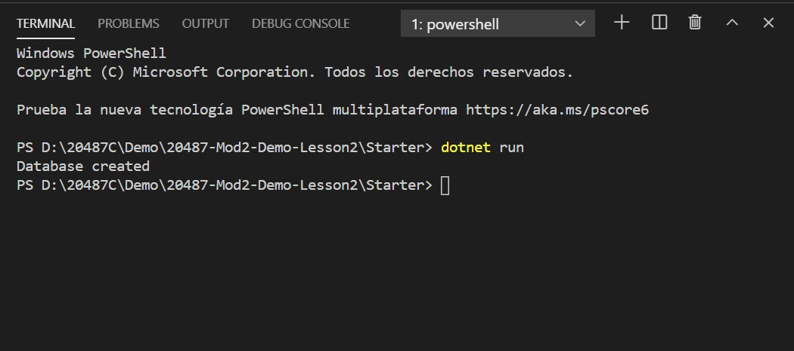
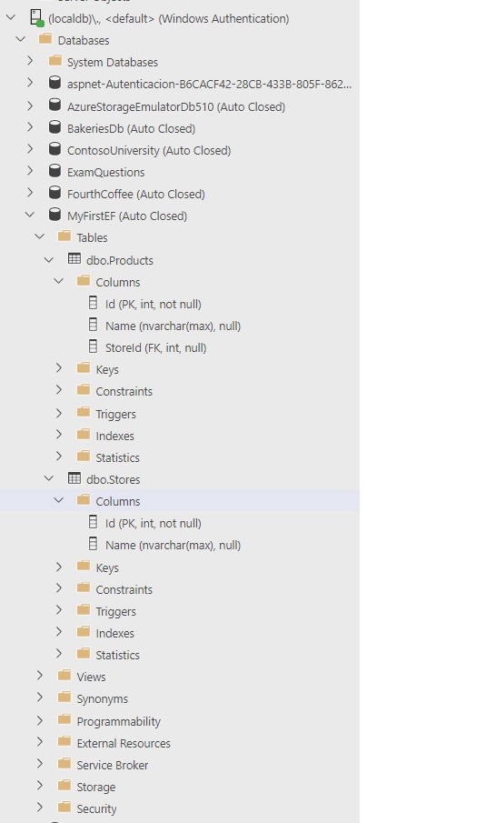

# Module 2: Querying and Manipulating Data Using Entity Framework

# Lesson 2: Creating an Entity Data Model

### Demonstration: Creating an Entity Type, DbContext, and DbInitializer

- Crear un nuevo proyecto de consola en Visual Studio Code desde la consola
- Crear las clases Product, Store y DBInitializer
- En el main inicializar la BD
- Ejecutar

Azure Data Studio

